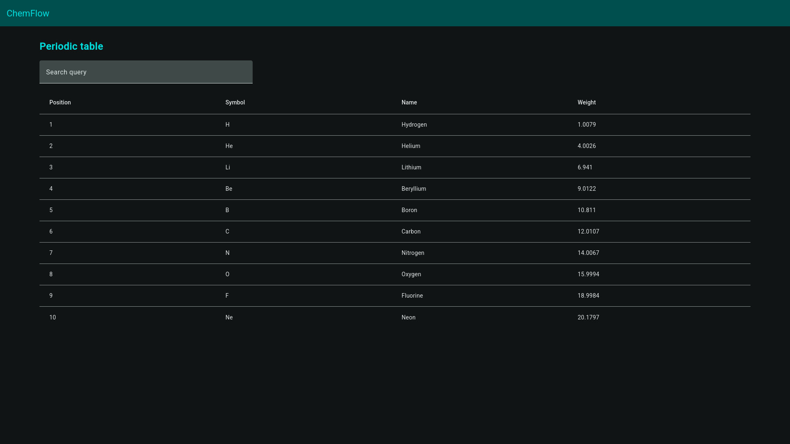
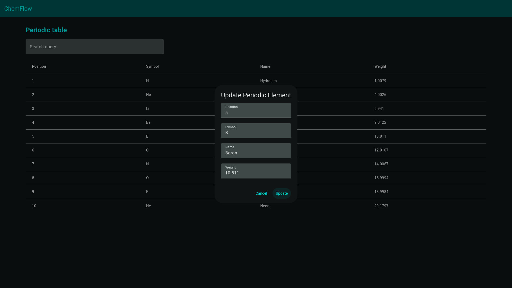

# ChemFlow

View displaying periodic elements in a table. Allows users to edit a selected element.

## Development server

To start a local development server, run:

```bash
ng serve
```

Once the server is running, open your browser and navigate to `http://localhost:4200/`. The application will automatically reload whenever you modify any of the source files.


## Building

To build the project run:

```bash
ng build
```

## Images

### Periodic table


### Periodic element edit

